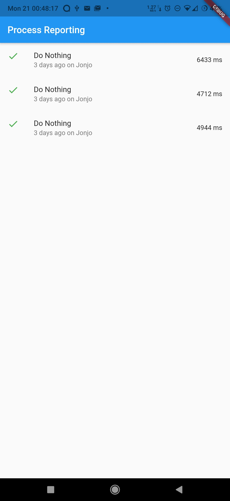
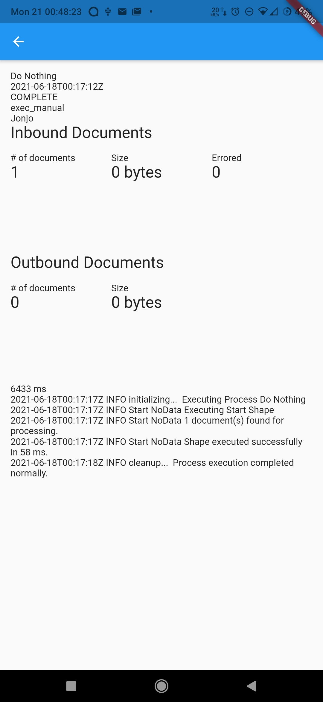

# Boomi

This is a personal project to create a mobile interface to Boomi Atomsphere.

## Download

You can download an Android APK from the [latest build on GitHub Actions](https://github.com/jonjomckay/boomi/actions).

## Screenshots

|  | 

## License

This project is released under the MIT License.
